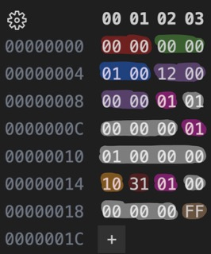

# 1 + 1 = 2

*Note*: This example, although seemingly valid, was created before I shifted around instruction opcodes. As such, PRINT_INT is no longer 0x31 and is how 0xF1.

Fun fact: **1 + 1 = 2**  
More specifically: `1 1 +` = 2

Program:

```txt
0x00 0x00 0x00 0x00 0x01 0x00   ; Version:  0.0.1
0x12                            ; Size:     18
0x01 0x01 0x00 0x00 0x00        ; PUSH 1
0x01 0x01 0x00 0x00 0x00        ; PUSH 1
0x10                            ; ADD
0x31                            ; PRINT_INT
0x01 0x00 0x00 0x00 0x00        ; PUSH 0
0xFF                            ; HALT
```

Output from debug mode:

```txt
== program ==
VERSION 0.0.1
SIZE    18
PROGRAM 0x01 0x01 0x00 0x00 0x00 0x01 0x01 0x00 0x00 0x00 0x10 0x31 0x01 0x00 0x00 0x00 0x00 0xFF 
2
```

Binary file:



| Color  | Description    | Value |
| ------ | -------------- | ----- |
| Red    | Major Version  | 0     |
| Green  | Minor Version  | 0     |
| Blue   | Patch Version  | 1     |
| Purple | Program Size   | 12    |
| Pink   | Push Operation | N/A   |
| White  | Value          | N/A   |
| Orange | Add Operation  | N/A   |
| Maroon | Print Int Operation  | N/A   |
| Brown  | Halt Operation | N/A   |
